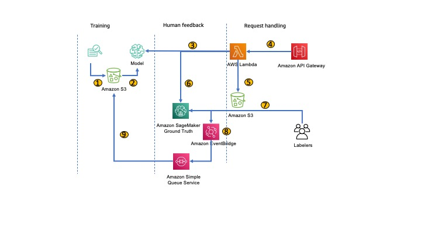

# Automating Incremental Training and Deployment 

In modern machine learning system, how to automating data collection and retain process is key to have your model keep up to date. This sample code demonstrates how to build the automated process on AWS sagemaker 

### Tomofun bark sound recognition AI competition template

This sample code is also a template for a [dog bark sound recognition competition](https://tbrain.trendmicro.com.tw/Competitions/Details/15) hold by a world leading pet camera company, Tomofun.  

### Architecture 

1. Training model by customized container  
2. Deploying model
3. Triggering endpoint by Lambda function 
4. Integrating Lambda function and API-Gateway 
5. Saving posted audio files to S3 
6. Initiating A2I tasks 
7. Users labels the incoming audios 
8. EventBridge passing label complete event to SQS 
9. User trigger retraining / update model  

### How to Use 
* Prepare the Environment 
1. Create a sagemaker notebook instance 
2. Execute prepare.ipynb

* Bring Your Own Algorithm on SageMaker 
This [notebook](https://github.com/aws-samples/incremental-training-mlops/blob/main/01-byoc/audio.ipynb) demonstrate how to develop your own algorithm on SageMaker 

* Data Collecting and Retrain Process 
This [notebook](https://github.com/aws-samples/incremental-training-mlops/blob/main/02-increment-train/a2i-audio-classification-and-retraining.ipynb) demonstrate how to setup data collection workflow and automate the retrain process. 

## Security

See [CONTRIBUTING](CONTRIBUTING.md#security-issue-notifications) for more information.

## License

This library is licensed under the MIT-0 License. See the LICENSE file.

